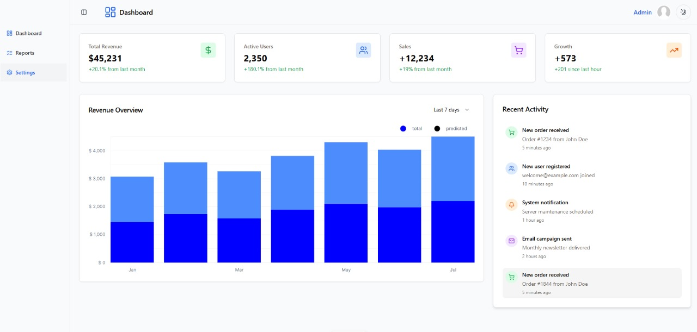
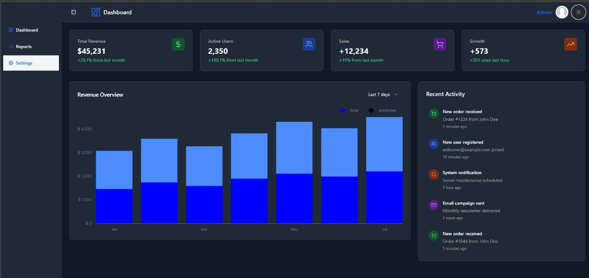

# Nuxt 3 Responsive Mini Dashboard

A modern, responsive dashboard application built with Nuxt 3, Tailwind CSS, and custom shadcn-vue components.





## Task Description

This project is a single-page, responsive dashboard application built with Nuxt 3, Tailwind CSS, and shadcn-vue components.

It includes the following features:

### 1. Header

- Built using the `Navbar` component from shadcn-vue
- Left: logo placeholder
- Right: user avatar
- Dark/light theme toggle using shadcn-vue’s switch component

### 2. Sidebar Navigation

- Collapsible on smaller screens
- Menu items:
  - Dashboard
  - Reports
  - Settings
- Built with `NavigationMenu` or a custom sidebar using shadcn-vue primitives

### 3. Main Content

- **Stats Cards**: Key metrics like total users and active users using dummy data
- **Chart Placeholder**: Box section to later hold a chart (no real charting logic included)
- **Recent Activity List**: List showing 5 recent user or system events with timestamps

### 4. Settings Modal

- Opens on "Settings" click in sidebar or top navigation
- Implemented using shadcn-vue `Dialog` or `Sheet`
- Includes:
  - Username input
  - Email input
  - Notification toggle switch
- Cancel and Save buttons to close or confirm

## Features

- 🎨 **Modern UI**: Clean, professional design with shadcn-vue inspired components
- 📱 **Fully Responsive**: Adapts seamlessly to desktop, tablet, and mobile devices
- 🌙 **Dark/Light Mode**: Toggle between light and dark themes
- 📊 **Dashboard Analytics**: Stats cards with dummy data and chart placeholders
- 🔧 **Settings Modal**: User preferences with form validation
- 📁 **Proper Structure**: Uses Nuxt 3 layouts, pages, and composition API
- 🎯 **Accessible**: Built with accessibility best practices

## Component Structure

### Layout Components

- `layouts/default.vue` - Main layout with header, sidebar, and settings modal
- `components/ui/` - Reusable UI components (Button, Card, Dialog, etc.)

### Pages

- `pages/index.vue` - Dashboard home with stats and activity

### Key Features

- **Responsive Sidebar**: Collapsible on mobile with hamburger menu
- **Stats Cards**: Display key metrics with growth indicators
- **Recent Activity**: Live activity feed with timestamps
- **Settings Modal**: User preferences with form controls
- **Theme Toggle**: Switch between light and dark modes

## Setup Instructions

1. **Install dependencies**:

```bash
npm install
```

2. **Start development server**:

```bash
npm run dev
```

3. **Build for production**:

```bash
npm run build
```

4. **Preview production build**:

```bash
npm run preview
```

## Tech Stack

- **Nuxt 3** - Vue.js framework with server-side rendering
- **Tailwind CSS** - Utility-first CSS framework
- **TypeScript** - Type-safe JavaScript
- **Lucide Vue** - Beautiful icons
- **Class Variance Authority** - Component variant management

## Responsive Design

- **Mobile**: Sidebar becomes hamburger menu, cards stack vertically
- **Tablet**: Sidebar remains collapsible, cards in 2-column grid
- **Desktop**: Full sidebar always visible, cards in 4-column grid

## Custom Components

The project includes custom shadcn-vue style components:

- `avater` - Avatar component with rounded corners
- `breadcrumb` - Breadcrumb navigation
- `Button` - Versatile button with multiple variants
- `Card` - Container component with header, content, and title
- `chart` - Reusable chart component
- `collapsible` - Collapsible component for sidebar and settings
- `Dialog` - Modal component for settings and interactions
- `Input` - Form input with consistent styling
- `Label` - Form labels with proper accessibility
- `Switch` - Toggle switch for settings
- `select` - Form select with consistent styling
- `skeleton` - Placeholder component for loading states
- `sidebar` - Sidebar component with collapsible and responsive design
- `switch` - Toggle switch for settings
- `tooltip` - Tooltip component with proper accessibility

## Development Notes

- Uses Nuxt 3 Composition API throughout
- Implements proper TypeScript types
- Follows Vue 3 best practices
- Responsive design with mobile-first approach
- Accessible components with proper ARIA attributes

The dashboard provides a solid foundation for building more complex dashboard applications with real data integration.
